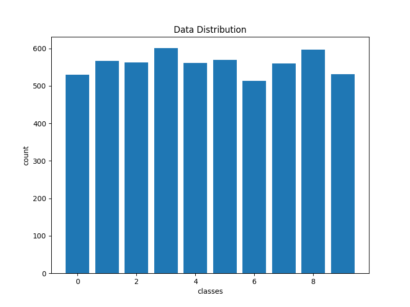

## Next
1. add LICENSE

Create flutter app
publish the data to kaggle

Names

* GridGuid Sudoku Board Detector & Solver

* BoldBlocks
* HyperGrid[taken]
* CipherMaze
* Gridix

* SudoQuest
* MindStrain
* NumberMaze
* cellMaster

References:
- https://youtu.be/wGH_KWpaAVM
- https://youtu.be/G_UYXzGuqvM
- https://youtu.be/lK4N8E6uNr4
- https://youtu.be/qOXDoYUgNlU

Image Requirments:
- clear picture
- one big digit at a cell
- no occulsion
- digit up and down no tilting
- only numbers

Plan
- collect many digit box data from sudoku board and also use the mnist digit dataset
- flutter upto statemanagement
- c++ in flutter
- build it
- animation
- ads

### Data
* https://github.com/wichtounet/sudoku_dataset
* https://github.com/akhilennu/sudoku_dataset
* https://github.com/prathamnishad/Sudoku-Dataset
* https://github.com/jeffreywolberg/sudoku_dataset
* https://github.com/jingyibo123/sudoku_dataset

### Game generator
* https://github.com/kairess/mnist_sudoku_generator

Features of the app
- solve sudoku by scaning image
- play sudoku game
- generate sudoku game as image

##### Illustrations
https://www.figma.com/community/file/890095002328610853
https://undraw.co
